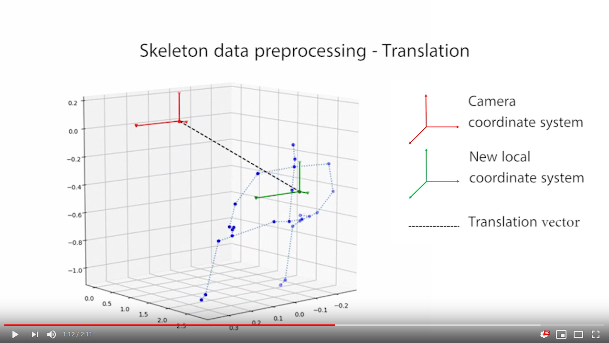
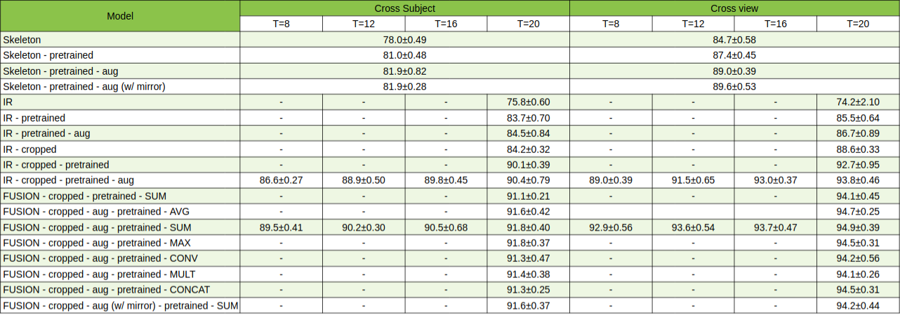
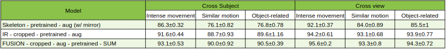

Infrared and 3D skeleton feature fusion for RGB-D action recognition (submitted to IEEE Access)
===============================================================================================

We propose a novel deep network fusing skeleton and infrared data for Human Action Recognition. The network is tested on the largest RGB+D dataset to date, NTU RGB+D. We report state-of-the-art performances with over 90% accuracy on both cross-subject and cross-view benchmarks. 

Project Organization
--------------------

    ├── LICENSE
    ├── Makefile           <- Makefile with commands like `make data` or `make train`
    ├── README.md          <- The top-level README for developers using this project.
    ├── data
    │   ├── processed      <- The final, canonical data sets for modeling.
    │   │   ├── missing_skeleton.txt   
    │   │   ├── samples_names.txt   
    │   │   ├── ir.h5 (1TB)   
    │   │   ├── ir_cropped.h5 (157.8GB)
    │   │   ├── ir_cropped_moving.h5 (60.8GB | optional)
    │   │   ├── ir_skeleton.h5 (2.0GB)
    │   │   ├── skeleton.h5 (3.0GB)   
    │   │      
    │   └── raw            <- The original, immutable data dump.
    │       ├── nturgb+d_ir         <- Raw IR videos (*.avi)
    │       ├── nturgb+d_skeletons  <- Raw skeleton files (*.skeleton)    
    │
    ├── docs               <- Sphinx generated documentation
    │   ├── source         <- .rst and conf.py to generate project documentation
    │
    ├── models             <- Trained models and paper results.
    │
    ├── notebooks          <- Jupyter notebooks. Naming convention is a number (for ordering),
    │                         the creator's initials, and a short `-` delimited description, e.g.
    │                         `1.0-jqp-initial-data-exploration`.
    │  
    ├── paper_cmds.txt     <- All commands used to replicate paper results
    │
    ├── references         <- Data dictionaries, manuals, and all other explanatory materials.
    │
    ├── reports            <- Generated analysis as HTML, PDF, LaTeX, etc.
    │   └── figures        <- Generated graphics and figures to be used in reporting
    │
    ├── requirements.txt   <- The requirements file for reproducing the analysis environment, e.g.
    │                         generated with `pip freeze > requirements.txt`
    │  
    ├── run_cc.sh          <- Shell script to train on Compute Canada cluster   
    |
    ├── setup.py           <- makes project pip installable (pip install -e .) so src can be imported
    ├── src                <- Source code for use in this project.
    │   ├── __init__.py    <- Makes src a Python module
    │   │
    │   ├── data           <- Create h5 datasets (see make data documentation)
    │   │   └── make_dataset.py
    │   │
    │   ├── models         <- Scripts to train models and then use trained models to make
    │       │                 predictions
    │       ├── predict_model.py
    │       └── train_model.py
    │
    └── tox.ini            <- tox file with settings for running tox; see tox.testrun.org

Project presentation
--------------------
A video presentation accompanies the project. 

The paper was accepted to IEEE Access : [paper](https://ieeexplore.ieee.org/document/9194767)

Please use the following bibtex to cite our work:

	@ARTICLE{9194767,
	  author={A. M. {De Boissiere} and R. {Noumeir}},
	  journal={IEEE Access}, 
	  title={Infrared and 3D Skeleton Feature Fusion for RGB-D Action Recognition}, 
	  year={2020},
	  volume={8},
	  number={},
	  pages={168297-168308},
	  doi={10.1109/ACCESS.2020.3023599}}

Getting started
---------------
The first step to replicate our results is to clone the project and create a virtual environment using the Makefile. After that, the raw data should be downloaded and placed according to the default Project Organization provided above. Then various h5 datasets will have to be created using the Makefile. This will take a while, but is a more practical way of handling data. Once the h5 files are created, you are ready to replicate our results or use them to implement your own models!

The data used comes from the [NTU RGB+D dataset](http://rose1.ntu.edu.sg/datasets/actionrecognition.asp).

1. Clone project

    `git clone https://github.com/gnocchiflette/FUSION-human-action-recognition`

2. Create virtual environment

    `make create_environment`

3. Activate environment (do so every time you work on this repository)

    `workon fusion` (for virtual env wrapper)

    `source activate fusion` (for conda)

4. Install requirements

    `make requirements`

5. Download raw data from the [NTU RGB+D website](http://rose1.ntu.edu.sg/datasets/actionrecognition.asp), decompress archives and place files as described in the Project Description above.

6. Run the `make data` commands to create the h5 files.

Make h5 datasets
----------------
Our FUSION model uses both pose and IR data. It is modular, so it is possible to start with one or the other (see the Train model section), but best results are achieved using a combination of the two. To replicate all results from the paper, all h5 datasets (except *ir_cropped_moving.h5*) must be created. Assuming the Project Organization is kept, here are the commands to create the different datasets. The files are **quite heavy**, check the Project Organization for exact sizes.

- **IR 2D skeleton dataset**

    `make data DATASET_TYPE=IR_SKELETON`

- **3D skeleton dataset**

    `make data DATASET_TYPE=SKELETON`

- **Raw IR sequences dataset**

    `make data DATASET_TYPE=IR`

- **Cropped IR sequences dataset** (requires ir.h5 and ir_skeleton.h5)

    `make data DATASET_TYPE=IR_CROPPED DATA_PATH="./data/processed/"`

- **[Optional] Cropped moving IR sequences dataset** (requires ir.h5 and ir_skeleton.h5)

    `make data DATASET_TYPE=IR_CROPPED_MOVING DATA_PATH="./data/processed/"`

It is not mandatory to keep raw and processed data in the *./data/* folder, though highly encouraged. They could be in a different location (ie. an external drive). However, **it is crucial to keep the h5 files names the same**. Should the data be in a different folder, you will have to specify the input (DATA_PATH) and the output path (PROCESSED_DATA_PATH). Check the project [documentation](https://adeboissiere.github.io/FUSION-human-action-recognition/) (**src.data** module) for details.

Train model
-----------
After the necessary h5 have been generated, it is time to test our FUSION model. To do so, use the `make train` command with the different hyperparameters. Below is an example of how to use the command, assuming the Project Organization is kept. For the commands used to obtain the results from the paper, check *paper_cmds.txt* in the root folder. 

**Note** that a folder with a unique name will be created upon calling the command.

    
    make train \
        EVALUATION_TYPE=cross_subject \
        MODEL_TYPE=FUSION \
        USE_POSE=True \
        USE_IR=True \
        PRETRAINED=True \
        USE_CROPPED_IR=True \
        LEARNING_RATE=1e-4 \
        WEIGHT_DECAY=0.0 \
        GRADIENT_THRESHOLD=10 \
        EPOCHS=15 \
        BATCH_SIZE=16 \
        ACCUMULATION_STEPS=1 \
        SUB_SEQUENCE_LENGTH=20 \
        AUGMENT_DATA=True \
        EVALUATE_TEST=True \
        SEED=0
    

If the h5 files are not in the default location, you need to specify the `PROCESSED_DATA_PATH` variable. If you would like to save the model elsewhere (default is *./data/models/*), you need to specify the `MODEL_FOLDER` variable.

Check the [documentation](https://adeboissiere.github.io/FUSION-human-action-recognition/) for more infos on the **src.model** module and the make train command.

Trained models
---------------------
You can find the trained following [this link](https://etsmtl365-my.sharepoint.com/:f:/g/personal/alban_main-de-boissiere_1_ens_etsmtl_ca/EkE2Uzx0YTtFlPZbY4mZvQYBfYPDL-RoLkgO6584aKmnlg?e=sy45Ab). Only the models using SEED=0 are included. The link automatically expires after 30 days, open a new issue if this is the case and I will reupload them.

Confusion matrix
---------------------
Once the model is trained, the confusion matrix is a great tool to understand where the model struggles. We provide a command to generate a .png image from a trained model. Below is an example of how to do so.

    make confusion_matrix \
        MODEL_FOLDER="./models/fusion_test_tube_seed=0/fusion_20/cross_subject/aug=True/" \
        MODEL_FILE="model12.pt" \
        EVALUATION_TYPE=cross_subject \
        MODEL_TYPE=FUSION \
        USE_POSE=True \
        USE_IR=True \
        USE_CROPPED_IR=True \
        BATCH_SIZE=1 \
        SUB_SEQUENCE_LENGTH=20 
        
Alternatively, the confusion matrix may be produced via the .cpkl file of the ground truth and predictions. This is much
faster. 

    make confusion_matrix_cpkl \
        MODEL_FOLDER=models/fusion_test_tube/seed=2/skeleton/cross_subject/pretrained=True_aug=True_mirror_s=True/ \
        CPKL_FILE=test_preds9.cpkl
        
##### Confusion matrix skeleton (pretrained, augmented, cross-subject)

##### Confusion matrix cropped infrared (T=20, pretrained, augmented, cross-subject)

##### Confusion matrix FUSION (sum) (T=20, pretrained, augmented, cross-subject)

Results
-------
Below is a summary of the results from the paper. We achieve state-of-the-art results. The log files of the trainings can be found in the *./models/fusion_test_tube_seed=\*/* folder.

Documentation
-------------
The project's code documentation is available [here](https://adeboissiere.github.io/FUSION-human-action-recognition/). Alternatively, should you need the documentation locally or update it, follow these steps (from root directory):

    cd docs
    make clean  # Remove previous build
    rm -f source/modules.rst source/src.*  # Remove previous generated .rst files
    sphinx-apidoc -o ./source ../src  # Generate .rst files from .py source files
    sphinx-build -b html ./source build  # Build html files

--------

<small>Project based on the <a target="_blank" href="https://drivendata.github.io/cookiecutter-data-science/">cookiecutter data science project template</a>. #cookiecutterdatascience</small>

